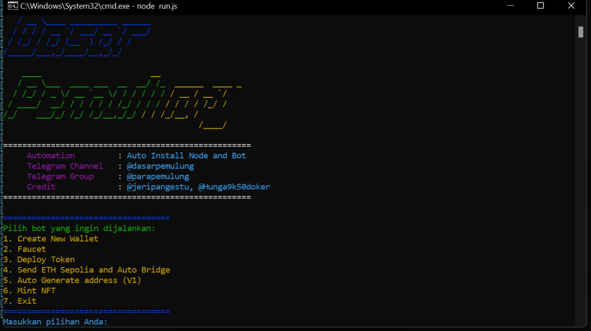

# Haust-V2-AIO

## Automation Testnet Haust V2



### Setup Instructions

#### IF YOU RUN WITH WALLET V1

1. Create a screen session:
   ```sh
   screen -S haust-v2
   ```
2. Navigate to the project directory:
   ```sh
   cd Haust-V2-AIO
   ```
3. Import your private key into `pk.txt`.
4. Install dependencies:
   ```sh
   npm install
   ```
5. Run the bot:
   ```sh
   node run.js
   ```
6. Follow these steps in the bot menu:
   - Choose **No. 5** for auto-generating an address.
   - Choose **No. 2** for the faucet (requires a proxy).
   - Choose **No. 3** to deploy.
7. Detach the screen session:
   ```sh
   Press Ctrl + A, then D
   ```
8. Create a new screen session for bridging:
   ```sh
   screen -S haustbridge
   ```
9. Navigate to the project directory:
   ```sh
   cd Haust-V2-AIO
   ```
10. Run the bot again:
    ```sh
    node run.js
    ```
11. Choose **No. 4** for automatic ETH sending and auto-bridging.

### Notes
- Ensure you have a working proxy for the faucet feature.
- Always keep your private key secure.
- Use `screen -r haust-v2` or `screen -r haustbridge` to reattach to running sessions.

### License
This project is licensed under the MIT License.

